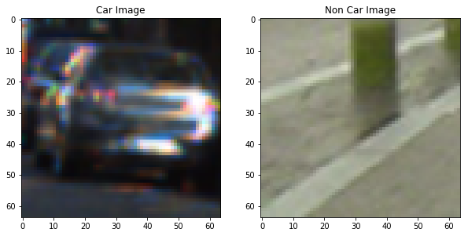
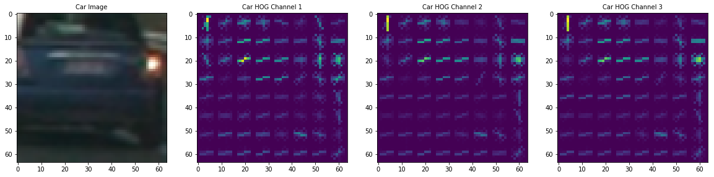
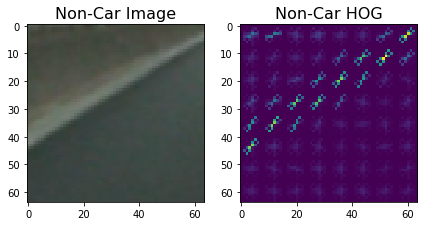
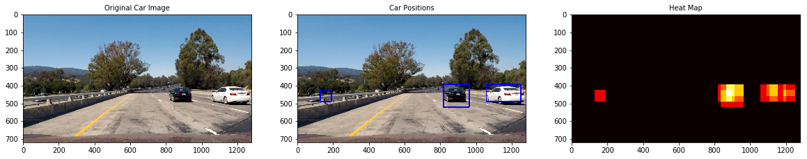

**Vehicle Detection Project**

The goals / steps of this project are the following:

* Perform a Histogram of Oriented Gradients (HOG) feature extraction on a labeled training set of images and train a classifier Linear SVM classifier
* Optionally, you can also apply a color transform and append binned color features, as well as histograms of color, to your HOG feature vector. 
* Note: for those first two steps don't forget to normalize your features and randomize a selection for training and testing.
* Implement a sliding-window technique and use your trained classifier to search for vehicles in images.
* Run your pipeline on a video stream (start with the test_video.mp4 and later implement on full project_video.mp4) and create a heat map of recurring detections frame by frame to reject outliers and follow detected vehicles.
* Estimate a bounding box for vehicles detected.

## [Rubric](https://review.udacity.com/#!/rubrics/513/view) Points
### Here I will consider the rubric points individually and describe how I addressed each point in my implementation.  

---
### Writeup / README

#### 1. Provide a Writeup / README that includes all the rubric points and how you addressed each one.  You can submit your writeup as markdown or pdf.  [Here](https://github.com/udacity/CarND-Vehicle-Detection/blob/master/writeup_template.md) is a template writeup for this project you can use as a guide and a starting point.  

You're reading it!

### Histogram of Oriented Gradients (HOG)

#### 1. Explain how (and identify where in your code) you extracted HOG features from the training images.
I started by reading in all the `vehicle` and `non-vehicle` images(Cell 4).  Here is an example of one of each of the `vehicle` and `non-vehicle` classes:

I then explored different color spaces and different `skimage.hog()` parameters (`orientations`, `pixels_per_cell`, and `cells_per_block`).  I grabbed random images from each of the two classes and displayed them to get a feel for what the `skimage.hog()` output looks like(Cell 10,Cell 11).I applied HOG to each channel of RGB image.
Here is an example using the `RGB` color space and HOG parameters of `orientations=9`, `pixels_per_cell=(8, 8)` and `cells_per_block=(2, 2)`(Cell ):

##### HOG Output for Car Image

##### HOG Output for Non-Car Image

#### 2. Explain how you settled on your final choice of HOG parameters.
I played around with different HOG parameters like orietntation, Pixels per Cell and Cell per block.I also tried different colorspaces and applying Hog to particular channel. As seen in Cell 17 and Cell 18.I then trained the classifier to derive the accuracy of the HOG parameters selected.I got the best accuracy for HOG Parameters Orientation =11,Pixels per cell = 16,Cell per Block = 2,HOG on ALL channels in YUV colorspace.
#### Exploring Orientations
Colorspace : YUV
133.82 Seconds to extract HOG features...
Using: 9 orientations 8 pixels per cell and 2 cells per block
Feature vector length: 5292
13.05 Seconds to train SVC...
Test Accuracy of SVC =  0.9865
My SVC predicts:  [0. 0. 1. 0. 1. 0. 0. 0. 1. 1.]
For these 10 labels:  [0. 0. 1. 0. 1. 0. 0. 0. 1. 1.]
0.00107 Seconds to predict 10 labels with SVC
Colorspace : YUV
140.03 Seconds to extract HOG features...
Using: 10 orientations 8 pixels per cell and 2 cells per block
Feature vector length: 5880
3.82 Seconds to train SVC...
Test Accuracy of SVC =  0.9927
My SVC predicts:  [1. 0. 1. 0. 0. 0. 1. 0. 0. 0.]
For these 10 labels:  [1. 0. 1. 0. 0. 0. 1. 0. 0. 0.]
0.00174 Seconds to predict 10 labels with SVC
Colorspace : YUV
143.05 Seconds to extract HOG features...
Using: 11 orientations 8 pixels per cell and 2 cells per block
Feature vector length: 6468
11.08 Seconds to train SVC...
Test Accuracy of SVC =  0.9848
My SVC predicts:  [1. 1. 1. 0. 1. 0. 0. 1. 1. 0.]
For these 10 labels:  [1. 1. 1. 0. 1. 0. 0. 1. 1. 0.]
0.00373 Seconds to predict 10 labels with SVC

#### Exploring Pixels per cell
Colorspace : YUV
154.74 Seconds to extract HOG features...
Using: 11 orientations 8 pixels per cell and 2 cells per block
Feature vector length: 6468
21.54 Seconds to train SVC...
Test Accuracy of SVC =  0.987
My SVC predicts:  [1. 1. 1. 1. 0. 1. 1. 0. 1. 1.]
For these 10 labels:  [1. 1. 1. 1. 0. 1. 1. 0. 1. 1.]
0.00229 Seconds to predict 10 labels with SVC
Colorspace : YUV
62.22 Seconds to extract HOG features...
Using: 11 orientations 16 pixels per cell and 2 cells per block
Feature vector length: 1188
1.78 Seconds to train SVC...
Test Accuracy of SVC =  0.9879
My SVC predicts:  [1. 0. 1. 0. 1. 0. 1. 1. 1. 1.]
For these 10 labels:  [1. 0. 1. 0. 1. 0. 1. 1. 1. 1.]
0.00252 Seconds to predict 10 labels with SVC

#### 3. Describe how (and identify where in your code) you trained a classifier using your selected HOG features (and color features if you used them).
The first step was to create a Feature Extraction function.I have used Spatial,Color and Hog Features.I then started trying different combinations and values of parameters for all the three features to achieve the best accuracy.I first tried these features individually.For Spatial Binning I tried various spatial_bin values(16 and 32).(Cell 14). For Color Histogram I played around with hist_bin values (Cell 15).

Next step was to explore various Color Spaces to find the best accuracy
#### Exploring Color Spaces for hist_bin = 32 and spatial_bin = 32

Colorspace : HSV
15.06 Seconds to extract Color and Spatial features...
Using Spatial Size : (32, 32) and using Histogram Bins: 32
Feature vector length: 3168
17.12 Seconds to train SVC...
Test Accuracy of SVC =  0.9383
My SVC predicts:  [0. 1. 0. 0. 1. 0. 0. 1. 0. 0.]
For these 10 labels:  [0. 1. 0. 0. 1. 0. 0. 1. 0. 0.]
0.00161 Seconds to predict 10 labels with SVC
Colorspace : HLS
15.65 Seconds to extract Color and Spatial features...
Using Spatial Size : (32, 32) and using Histogram Bins: 32
Feature vector length: 3168
17.21 Seconds to train SVC...
Test Accuracy of SVC =  0.9355
My SVC predicts:  [0. 0. 0. 0. 0. 0. 0. 0. 1. 0.]
For these 10 labels:  [0. 0. 0. 0. 0. 0. 0. 0. 1. 0.]
0.001 Seconds to predict 10 labels with SVC
Colorspace : YUV
14.33 Seconds to extract Color and Spatial features...
Using Spatial Size : (32, 32) and using Histogram Bins: 32
Feature vector length: 3168
14.46 Seconds to train SVC...
Test Accuracy of SVC =  0.955
My SVC predicts:  [0. 0. 0. 1. 1. 1. 1. 0. 1. 0.]
For these 10 labels:  [1. 0. 0. 1. 1. 1. 1. 1. 1. 0.]
0.00122 Seconds to predict 10 labels with SVC
Colorspace : YCrCb
14.18 Seconds to extract Color and Spatial features...
Using Spatial Size : (32, 32) and using Histogram Bins: 32
Feature vector length: 3168
14.55 Seconds to train SVC...
Test Accuracy of SVC =  0.9496
My SVC predicts:  [1. 0. 1. 1. 1. 1. 0. 0. 0. 0.]
For these 10 labels:  [1. 0. 1. 1. 1. 1. 0. 0. 0. 0.]
0.00117 Seconds to predict 10 labels with SVC

As seen from the above result I got the best accuracy for Color Space YUV,Spatial Bins 32,Histogram Bins = 32.
The next step was to combine all the three features : Spatial,Color, and HOG.I tried different permutations and combinations.

I tried combining all the three features.The following is the the accuracy:

#### Exploring Spatial,Color and HOG combined.
###### Accuracy for Spatial Bin = 32,Histogram Bin = 32,Colorspace YUV,Pixel per cell = 16,Cell per block =2, orientation = 11 , HOG Channel = ALL

Colorspace : YUV
68.06 Seconds to extract HOG features...
Using Spatial Size : (32, 32) and using Histogram Bins: 32
Using: 11 orientations 16 pixels per cell and 2 cells per block
Feature vector length: 4356
8.14 Seconds to train SVC...
Test Accuracy of SVC =  0.9924
My SVC predicts:  [0. 0. 1. 0. 1. 0. 0. 1. 0. 1.]
For these 10 labels:  [0. 0. 1. 0. 1. 0. 0. 1. 0. 1.]
0.00273 Seconds to predict 10 labels with SVC

I saw the Feature Vector size was huge.This would mean more prediction time.Since we need to use this classifier for a video prediction time becomes crucial too.Hence I used the following parameters to train to my classifier.The following is the accuracy obtained:

#### Final Classifier Parameters
Colorspace : YUV
70.85 Seconds to extract HOG features...
Using: 11 orientations 16 pixels per cell and 2 cells per block
Feature vector length: 1188
1.86 Seconds to train SVC...
Test Accuracy of SVC =  0.9868
My SVC predicts:  [0. 1. 1. 1. 0. 1. 0. 1. 1. 0.]
For these 10 labels:  [0. 1. 1. 1. 0. 1. 0. 1. 1. 0.]
0.00183 Seconds to predict 10 labels with SVC

As seen the Feature Vector size is small and hence the time to predict.The accuracy is quite good too

After extracting all features, the next step is to split the data into Training and test data.The next step was to create SVM classifier.I used Liner SVM classifier.The classifier was then trained with the training data and tested against  test data.The results were good.

### Sliding Window Search

#### 1. Describe how (and identify where in your code) you implemented a sliding window search.  How did you decide what scales to search and how much to overlap windows?
The find_car(Cell 23) method implements the Sliding Window Approach.This method is an efficient way to search and classify.By using Hog Sub Sampling Window Search, we restrict extracting HOG features just once for each of a small set of predetermined window sizes.This can then be subsampled to get all of the overlaying windows.The scaling factor determines the search window size.

The code uses window size of 64X64.By changing parameters like Cell_per_step we can control the overlap of the window too.
The search window regions were derived by trying out different window with different scaling factors.
The Following are the search regions and scaled I used:

ystart = 394 
ystop = 650 
scale = 1.0

ystart = 394 
ystop = 650 
scale = 1.5
    
ystart = 394 
ystop = 586 
scale = 2.0
    

ystart = 394 
ystop = 586 
scale = 2.5
    
ystart = 394 
ystop = 490 
scale = 3 
    
The following is the output for each of the test images for different search window size and scaling factors.This exercise helped me decide various search window sizes and scaling required to detect cars in the video successfully

The next step was to implement HeatMap.As seen in the above image, there are lots of false positives and multiple detections.The solution used to minimize them is HeatMap.The idea is to add +1 to all the pixels that are positive detections within a window.The HeatMap value is high for area where we have maximum detections.This value is thresholded against  threshold value 1 to get rid of false positives.The next step is to figure out  the number of cars detected in a frame and which pixel belongs to which car.This is done by using  label function from scipy.ndimage.measurements.The labels returns the number of cars detected.We draw rectangles around the detected cars with the function draw_labeled_bboxes and draw_boxes.The function draw_labeled_bboxes returns the coordinates of the car detected.

#### 2. Show some examples of test images to demonstrate how your pipeline is working.  What did you do to optimize the performance of your classifier?

The following images demonstrate clearly that the pipeline works as expected

##### Demonstrating Final Pipepine 

As mentioned above,I earlier used all three features to train, classify and extract features.This was not so optimal.By reducing the feature vector, the prediction time was reduced considerably.The accuracy is still around 98.5% as compared to 99% for three features approach.The prediction time for the final approach is 0.00183 while the prediction time for three feature approach is 0.00273.Also I made sure to use pixels er cell value as 16.This helps in optimizing the classifier a lot.
---

### Video Implementation

#### 1. Provide a link to your final video output.  Your pipeline should perform reasonably well on the entire project video (somewhat wobbly or unstable bounding boxes are ok as long as you are identifying the vehicles most of the time with minimal false positives.)
Here's a [link to my video result](project_video.mp4)

#### 2. Describe how (and identify where in your code) you implemented some kind of filter for false positives and some method for combining overlapping bounding boxes.
The video pipeline is similar to the image pipeline.The function process_image is implemented to support video data.To accommodate the impact of changing frames of a video few modifications are made to the pipeline to reduce the false positives and make the detections smooth.

The history of detections last 15 frames is saved.The heat map calculation takes the into account the history of last 15 frames.This heatmap value is thresholded against value 8.

---

### Discussion

#### 1. Briefly discuss any problems / issues you faced in your implementation of this project.  Where will your pipeline likely fail?  What could you do to make it more robust?

- The issues I faced was using train and test data of different format(png,jpg).I had to take care of converting images to their appropriate colorspace based on the API used to read the data.
- Another issue faced was trying out different parameters, features,permutation and combinations of parameters and features to come up with optimal classifier. It was pretty time consuming and tedious.There were too many factors to consider like size of feature vector, accuracy execution time etc.

In order to make my pipeline more robust,I can add more overlapping areas to have good detections.

